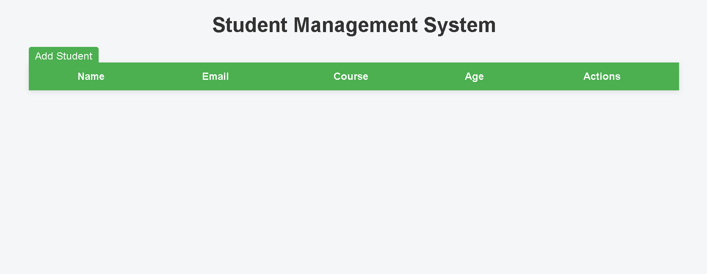

# 🎓 Django Student Management System

A **Django CRUD Web Application** built to manage student records efficiently.  
This project demonstrates backend development using **Python and Django**, implementing Create, Read, Update, and Delete (CRUD) operations with a clean UI.

---

# 🚀 Features

- Add new students
- View all students
- Update student details
- Delete student records
- Simple and clean user interface
- Styled using custom CSS
- Backend powered by Django ORM

---

# 🛠️ Technologies Used

- Python
- Django
- HTML
- CSS
- SQLite
- Git & GitHub

---

# 📂 Project Structure


django-student-management-system
│
├── students
│ ├── models.py
│ ├── views.py
│ ├── urls.py
│ ├── templates
│ └── static
│
├── student_project
│
├── manage.py
└── README.md


---

# ⚙️ Installation & Setup

Clone the repository

```bash
git clone https://github.com/YOUR_USERNAME/django-student-management-system.git

Navigate into the project

cd django-student-management-system

Install dependencies

pip install django

Run the server

python manage.py runserver

Open browser


http://127.0.0.1:8000

📊 Application Workflow

User sends request from browser

Django URL dispatcher routes request to views

Views interact with the database using Django ORM

Data is processed and passed to templates

HTML response is returned to the browser

📸 Screenshots
📄 Student List Page


➕ Add Student Page

✏️ Edit / Delete Student Page

📌 CRUD Operations Implemented
Operation	Description
Create	Add new student record
Read	Display student list
Update	Modify student details
Delete	Remove student record
🧠 Learning Outcomes

Django project structure

Django Models and ORM

URL routing

Django views and templates

CRUD operations in Django

Static file management (CSS)

Version control using Git and GitHub

👨‍💻 Author

Laxman Sannu Gouda

GitHub: https://github.com/YOUR_USERNAME

LinkedIn: Add your LinkedIn link here
